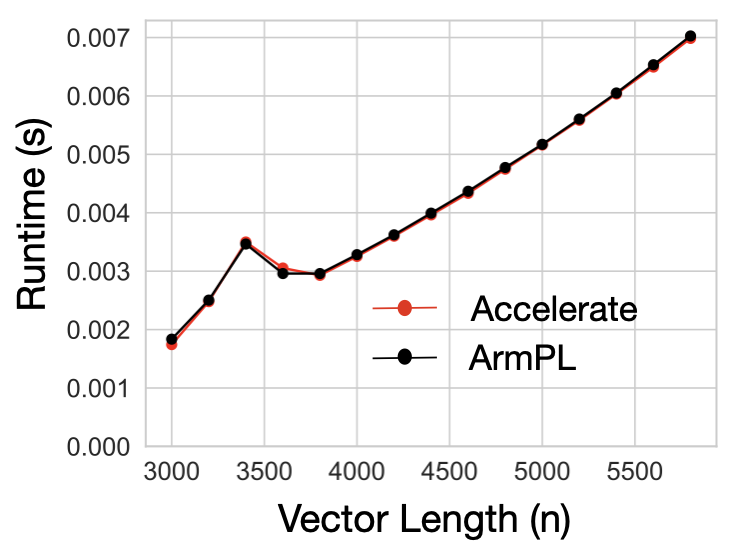
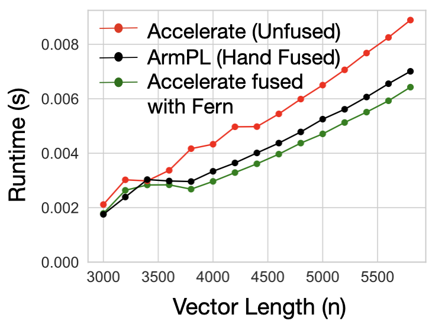

# An Introduction to Operator Fusion 

## A Simple Example

Consider a simple function that takes in an array of floats `$a$`, 
and adds 1 to each element, storing its output in `$b$`:

```C++
void add_1(float * a, float *b, int N){
    for (int i = 0; i < N; i++){
        b[i] = a[i] + 1;
    }
}
```

To perform 2 to elements to an array, we can simply call `add_1` twice:

```C++
    float * a  = (float *) malloc(N * sizeof(float)) 
    float * b  = (float *) malloc(N * sizeof(float)) 
    float * c  = (float *) malloc(N * sizeof(float)) 
    add_1(b, a, N);
    add_1(c, b, N);
```

or, we can implement a special  `add_2` function:

```C++
void add_2(float * a, float *b, int N){
    for (int i = 0; i < N; i++){
        b[i] = a[i] + 2;
    }
}
```

and simply call it:

```C++
    float * a  = (float *) malloc(N * sizeof(float)) 
    float * c  = (float *) malloc(N * sizeof(float)) 
    add_2(c, a, N);
```

The `add_2` function not only uses less memory, requiring no allocation for an
intermediate, it also takes advantage of *locality*. Each float is loaded once
and all operations are applied immediately, when the data is ready. This
technique of applying a sequence of operations back-to-back on susbets of data
rather than computing entire intermediate outputs is called **operator fusion**.


Traditionally, your favorite compiler runs a fusion pass, bringing computations
into the same outer-loop scope when it can determine that the transformation is
correct. While these passes typically fuse at single data element granularity,
one can also generalize this idea to instead think about fusion happening at
different granularities (4 elements, 8 elements, tiles of data, etc.).


## Operator Fusion in Practice 

High-performance applications are often built as compositions of function calls,
many sourced from mature, highly optimized libraries like CBLAS.  On Apple’s M3
chip, the fastest implementations of the CBLAS interface can be found in
frameworks such as Accelerate and Arm Performance Libraries.

> CBLAS itself contains several fused interfaces. For example, cblas_sgemm
> performs a matrix-matrix multiplication with optional transposition and
> scaling, all in a single call. 

Say we want to compute a General Vector Rank Update (GER)
operation expressed as \\( A = \alpha (x \times y^T) + A \\) where \\( A \\) is
a matrix, \\( x \\) and  \\( y \\) are vectors, \\( \alpha \\) is a scalar, and
all datatypes are floats. Both Accelerate and ArmPL offer implementations of
this operation, and their performance is pretty close.

<div style="text-align: center;">
  
</div>

If we were to comupute a slight variant of our computation, an SGERB \\( A = \alpha (x
\times y^T) + \beta A \\), we have two options. First,
we can use ArmPL’s fused BLAS extension interfaces that include an `sgerb_` subroutine. Or, as
Accelerate has no fused subroutine, we can compose Accelerate’s `cblas_sger` and `cblas_saxpy`
subroutines. 

<div style="text-align: center;">
  
</div>


However, the fused ArmPL subroutine is 1.24× (geomean) faster than the composed
Accelerate implementation. Since Accelerate already matched ArmPL’s performance
on GER, the performance difference between the two implementations on GERB is
not due to an under-optimized inner loop or poor instruction selection, but is
rather introduced at the point of composition. ArmPL is able to *fuse* its
computation, resulting in the difference that we see. 

In our trivial example with `add_1`, we could quickly write a fused
implementation. However, in this case, we are stuck: each routine `cblas_sger`
and `cblas_saxpy` likely contains hundereds of lines of hairy,
architecture-specific code that would be time consuming to rewrite and error prone
to modify. Worse, both ArmPL and Accelerate are propriety frameworks. In fact, the
Accelerate library is the only way to target undocumented, Apple-specific
hardware. If our user wants to use this special hardware, they are tied to the
Accelerate library, which does not have extended BLAS kernels like
`sgerb_`. But, if our user wants to use fused implementations provided in
the BLAS extension interface, they must use ArmPL.

Instead of using naive subroutine calls for Accelerate, the user can use code
generated by Fern, which continues to call Accelerate subroutines, but does so
for small tiles of the output at a time. To see how to do this, head to the
[tutorial](./tutorial/overview.md).